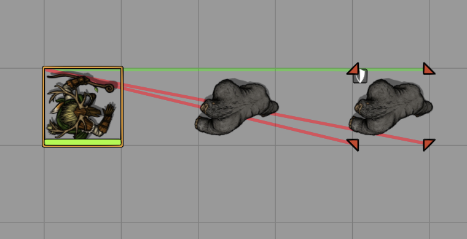
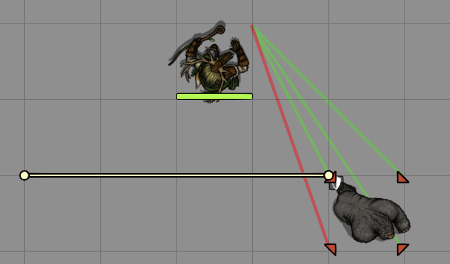
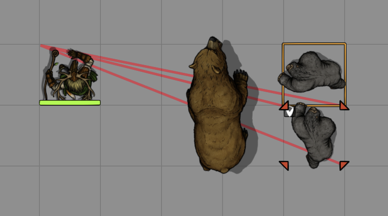
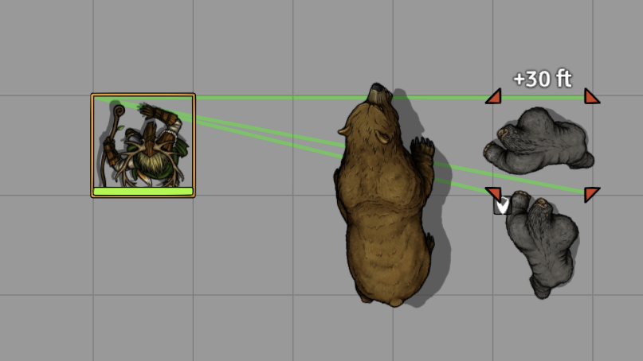

# SimpleCover5e

**SimpleCover5e** automatically evaluates cover for the **DnD5e** system in Foundry VTT during attack rolls and saving throws (multi-target supported). It applies the correct mechanical bonuses (+2 / +5) to the roll, updates chat/card displays, and sets/clears target status effects. The module also adds a custom *Ignore Cover* item property that you can enable on specific items (e.g., *Sacred Flame*) to bypass cover for that roll.

## How It Works

- Uses the DMG-style line-of-effect approach:
  - **Square / Gridless**: pick an optimal attacker corner and conceptually trace to the target’s four (inset) corners.
  - **Hex**: pick an optimal attacker corner and trace to the six (inset) corners of the target hex.
- Cover thresholds:
  - **Square / Gridless**: if **1–2** lines are blocked, the target gains **Half Cover**; if **3–4** lines are blocked (and the effect still reaches), the target gains **Three-Quarters Cover**.
  - **Hex**: if **1–3** lines are blocked, the target gains **Half Cover**; if **4–6** lines are blocked (and the effect still reaches), the target gains **Three-Quarters Cover**.
- Blocking tokens are treated as 3D prisms with configurable heights by creature size (see table below). Effects are pushed directly into the roll (chat target AC / save bonus) and synchronized with token status effects.
- On **gridless** scenes, larger tokens (Large and bigger) are evaluated using virtual sub-cells to approximate the multi-square behaviour from square grids where no RAW gridless procedure exists.
- Tiny creatures use the token’s actual position and footprint within their cell/hex instead of the grid cell center, improving accuracy when multiple Tiny tokens share the same space.
- The module introduces an *Ignore Cover* item property. Add it to spells, weapons, or feats that should ignore cover (for example, *Sacred Flame*) and the cover calculation will be skipped for that roll.
- The feats **Sharpshooter** and **Spell Sniper** are automatically respected when present on the attacker, either by their English name or by a matching `system.identifier` (e.g. `"sharpshooter"` / `"spell-sniper"`).

### Default Creature Heights

These are the default 3D heights (in feet) used for cover evaluation. They can be customized in the module settings.

| Size        | Height (ft) |
|-------------|-------------:|
| tiny        |            1 |
| small       |            3 |
| medium      |            6 |
| large       |           12 |
| huge        |           24 |
| gargantuan  |           48 |

## Settings

- **Cover Removal Scope** — Choose which tokens are affected when cover is cleared: *All Tokens on Scene*, *Combatants Only*, or *Player-Owned Tokens Only*.
- **Clear Cover on Combat Updates** — When rounds/turns/initiative change, remove cover according to the selected scope.
- **Clear Cover on Token Movement (Combat Only)** — When a token moves during active combat, remove cover according to the selected scope.
- **Limit Cover from Creatures to Half Cover** — When enabled, creature occlusion alone can grant at most Half Cover; creatures never upgrade a target to Three-Quarters Cover by themselves. Walls and other occluders still follow the normal DMG thresholds.
- **Apply Cover Only In Combat** — Only run automatic cover evaluation while a combat encounter is active on the scene (no cover checks outside of combat).
- **Show Cover Debug Lines** — Renders helper segments used during cover evaluation (GM only).
- **Creature Heights** — Configure the default 3D heights (in feet) for each size category used when treating tokens as prisms for cover.

### Notes & Limitations

- Gridless and hex behaviour for large creatures and Tiny positioning are reasonable approximations where RAW is unclear; feedback and alternative suggestions are welcome.
- The *Ignore Cover* item property is added by this module and can be toggled per item.
- Multi-target rolls are supported.

## Planned Features

- Alternate cover calculation for attacker on walls with holes (e.g., arrow slits or windows)
- Midi QoL integration
- RSR integration
- Wall Height integration (Foundry V13 only; likely obsolete with V14+ scene levels)

## Examples (with active debug mode)

