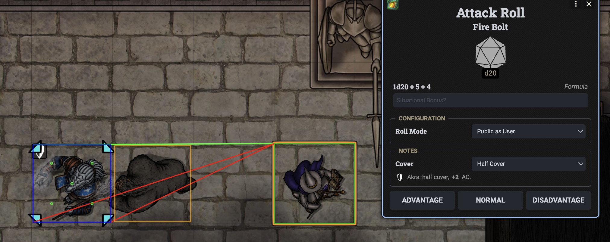
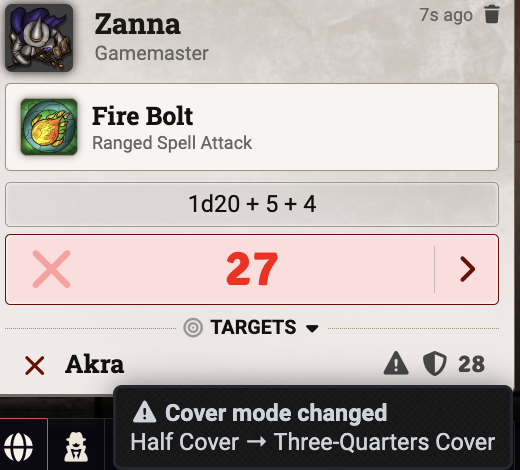
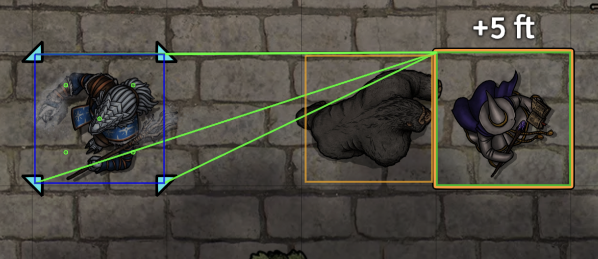
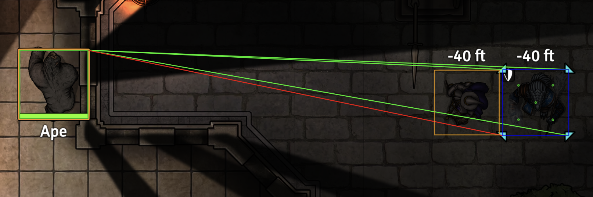
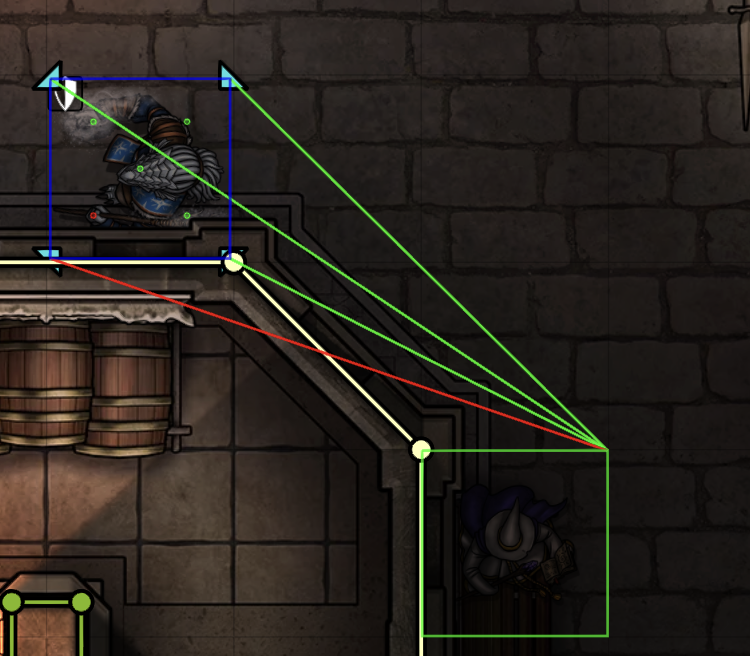
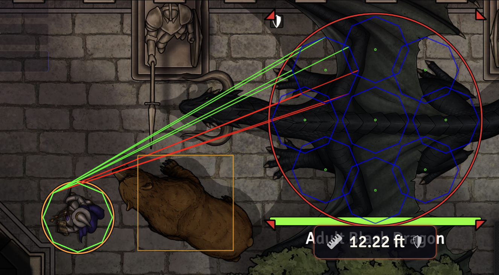

# Simple Cover 5e

**Simple Cover 5e** automatically evaluates cover for the **DnD5e** system in Foundry VTT during attack rolls and saving throws (multi-target supported). It applies the correct mechanical bonuses (+2 / +5) to the roll, updates chat/card displays, and sets/clears target status effects.

## How It Works

- Uses a DMG-style line-of-effect approach:
  - **Square grid**: choose an optimal attacker corner and trace to the target’s four (inset) corners.
  - **Gridless (Square Shape)**: tokens are treated as squares; cover is evaluated by tracing to four (inset) corners of each sampled target cell, similar to a square grid.
  - **Gridless (Circle Shape)**: tokens are treated as circular footprints; cover is evaluated using a fixed set of sample points within the token footprint (size-dependent), and corner samples are taken from an 8-point (inset) ring on the circumference.
  - **Hex**: choose an optimal attacker corner and trace to the target hex’s (inset) corner samples.
- Cover thresholds:
  - **Square / Gridless (Square Shape)**: if **1–2** lines are blocked, the target gains **Half Cover**; if **3** lines are blocked, the target gains **Three-Quarters Cover**.
  - **Hex**: if **1–3** lines are blocked, the target gains **Half Cover**; if **4+** lines are blocked, the target gains **Three-Quarters Cover**.
  - **Gridless (Circle Shape)**: uses an 8-sample perimeter; if **1–5** lines are blocked, the target gains **Half Cover**; if **6+** lines are blocked, the target gains **Three-Quarters Cover**.
- Blocking tokens are treated as 3D prisms using Foundry V14's native token depth. Non-blocking creatures (hidden tokens, ethereal/dead creatures, or creatures with 0 max HP) are ignored when evaluating cover.
- Effects are pushed directly into the roll (target AC / save DC adjustments) and synchronized with token status effects.
- On **gridless** scenes, larger tokens are evaluated using multiple sample centers (virtual sub-cells / multi-sample layouts) to approximate multi-square behavior where no RAW gridless procedure exists.
- (Optional) A token hover helper can display cover icons and/or a distance label near the hovered token, styled similarly to the core distance ruler and configurable in position and offset.
- (Optional) A wall-only **line of sight (LoS)** check can be performed. The LoS test mirrors Foundry’s vision sampling: a single origin at the attacker’s vision-source position and a 3×3 sampling grid around the target’s center. If the LoS test fails, the target is treated as having **Total Cover**.
- (Optional) A debug overlay can draw the evaluated cover segments as colored lines (green for clear, red for blocked), outline the token shapes used internally (attacker, target and creature occluders), and mark LoS sample points.
- Cover rules (including fixed rules and optional rule switches such as ignore-cover logic and feat interactions) are documented in the Wiki: [Cover Rules](https://github.com/Kapuzenjoe/simplecover5e/wiki/Cover-Rules).

## Settings

You can find the possible settings in the Wiki: [Settings](https://github.com/Kapuzenjoe/simplecover5e/wiki/Settings).

## Integration & API (Library Mode)

Simple Cover 5e exposes a small API that other modules can use to query cover without relying on Active Effects or automatic roll mutation. The API is available via the module entry:

The functions and usage of Library Mode can be found in the Wiki: [API-(Library-Mode)](https://github.com/Kapuzenjoe/simplecover5e/wiki/API).

## Compatibility

### Midi-QOL

- Official integration is available with **Midi-QOL v13.0.30+**.

### RSReforged (the successor to Ready Set Roll)

- Compatible with **RSReforged v4.13.4+**.

### Wall Height

- Wall Height wall bounds (`top` / `bottom`) are treated as 3D barriers while the module remains supported: a cover line is only blocked if the 3D line between attacker and target passes through the wall’s height range.
- Creature height is still resolved from Foundry V14 native token depth. Wall Height no longer replaces creature height data.

## Screenshots

The debug overlay is enabled where the image focuses on cover sampling or line-of-sight behavior.

<table>
  <tr>
    <td colspan="2">
      <strong>Attack roll cover note</strong> 
      
    </td>
  </tr>
  <tr>
    <td width="50%">
      <strong>GM cover change indicator</strong> 
      
    </td>
    <td width="50%">
      <strong>Hover cover and distance label</strong> 
      
    </td>
  </tr>
  <tr>
    <td colspan="2">
      <strong>Elevation-aware cover and LoS</strong> 
      
    </td>
  </tr>
  <tr>
    <td width="50%">
      <strong>Wall line-of-sight debug</strong> 
      
    </td>
    <td width="50%">
      <strong>Gridless large-token sampling</strong> 
      
    </td>
  </tr>
</table>
